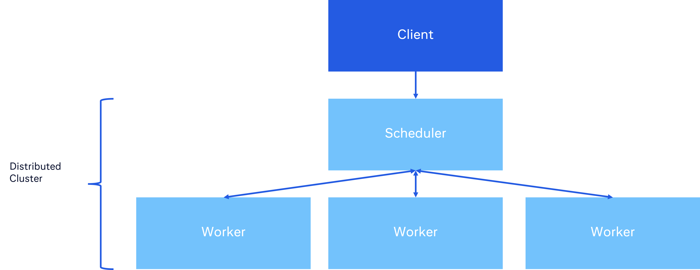

Quickstart
==========

When to use it
--------------

Scaler is inspired by dask and meant to be yet another parallel backend. It handles the communication between a Client, Scheduler, and Workers to orchestrate the execution of tasks. It is a good fit to scale out compute heavy jobs that are running too slow. Even on a local machine, slow jobs can be speed up through parallelization.

Architecture
------------

Below is a diagram of the relationship of the Client, Scheduler, and Workers.

* The Client submits tasks to the scheduler. This is the primary user-facing API.
* The Client is responsible for define how to serialize the tasks
* The Scheduler distributes the tasks to the workers
* Workers perform the computation and return the results

.. note::
    Though the architecture is similar to Dask, Scaler has a stronger decoupling of these systems. For example, the Client doesn't directly see the number of workers. There is a stronger separation of concerns.

Setup
-----

First, add the ``scaler`` package to your *requirements.txt* file, or install it using PIP:

.. code:: bash

    pip install scaler

First Look (Code API)
---------------------

Client.map
----------

In the example below, we spin up the ``SchedulerClusterCombo`` by giving the scheduler address along with the number of
workers. The `Client` then connects to the scheduler address.

if user have series tasks for the same function, ``client.map()`` is used to pass that function and list of arguments to
the scheduler.

.. code:: python

    import random

    from scaler import Client, SchedulerClusterCombo

    def calculate(sec: int):
        return sec * 1

    def main():
        address = "tcp://127.0.0.1:2345"

        cluster = SchedulerClusterCombo(address=address, n_workers=3)
        with Client(address=address) as client:
            tasks = [random.randint(0, 100) for _ in range(1000)]
            results = client.map(calculate, [(i,) for i in tasks])
            assert results == tasks

        cluster.shutdown()

    if __name__ == "__main__":
        main()

Client.submit
-------------

There is another way of to submit task to the scheduler: ``client.submit()``, which is used to submit a single function
and arguments, the results will be lazily retrieved on the first call to result()

.. code:: python

    import random

    from scaler import Client, SchedulerClusterCombo

    def double_it(arg: int):
        return arg * 2

    def main():
        address = "tcp://127.0.0.1:2345"

        cluster = SchedulerClusterCombo(address=address, n_workers=3)

        argument = random.randint(0, 100)

        with Client(address=address) as client:
            future = client.submit(calculate, argument)
            print(f"random picked argument: {argument}")
            print(f"double_it(arg={argument}): {future.result()}")

        cluster.shutdown()

    if __name__ == "__main__":
        main()

Anti-patterns
-------------

please note that the ``client.submit()`` is used to submit a single function and arguments, if you want submit same
function with many arguments, use ``client.map()``. otherwise it will be extremely slow, because it will serialize the
function every single time when ``client.submit()`` get called, following is exactly the anti pattern, if you have a
heavy function

.. code:: python

    import functools
    import random

    from scaler import Client, SchedulerClusterCombo

    def lookup(heavy_map: bytes, index: int):
        # assume this function has
        return index * 1

    def main():
        address = "tcp://127.0.0.1:2345"

        cluster = SchedulerClusterCombo(address=address, n_workers=3)

        # assume you are packing a heavy function
        big_func = functools.partial(lookup, b"1" * 5_000_000_000)

        arguments = [random.randint(0, 100) for _ in range(100)]

        with Client(address=address) as client:
            futures = [client.submit(big_func, i) for i in arguments]
            print([fut.result() for fut in futures])

        cluster.shutdown()

    if __name__ == "__main__":
        main()

This will be extremely slow, because it will serialize the function every single time when ``client.submit()`` get
called. Also only when ``fut.result()`` get called, it will reach to the scheduler to get actual result. It will get
even worse if your function is very heavy (like enclosed with heavy objects), consider use ``client.send_object`` to
send the heavy object to the scheduler, and use ``client.submit`` to submit the function with the object reference.

Spinning up Scheduler and Cluster Separately
--------------------------------------------

The scheduler and workers can be spun up independently through the CLI.

.. code:: bash

    scaler_scheduler tcp://127.0.0.1:8516

.. code:: console

    [INFO]2023-03-19 12:16:10-0400: logging to ('/dev/stdout',)
    [INFO]2023-03-19 12:16:10-0400: use event loop: 2
    [INFO]2023-03-19 12:16:10-0400: Scheduler: monitor address is ipc:///tmp/0.0.0.0_8516_monitor
    [INFO]2023-03-19 12:16:10-0400: AsyncBinder: started
    [INFO]2023-03-19 12:16:10-0400: VanillaTaskManager: started
    [INFO]2023-03-19 12:16:10-0400: VanillaObjectManager: started
    [INFO]2023-03-19 12:16:10-0400: VanillaWorkerManager: started
    [INFO]2023-03-19 12:16:10-0400: StatusReporter: started

.. code:: bash

    scaler_worker -n 10 tcp://127.0.0.1:8516

.. code:: console

    [INFO]2023-03-19 12:19:19-0400: logging to ('/dev/stdout',)
    [INFO]2023-03-19 12:19:19-0400: ClusterProcess: starting 10 workers, heartbeat_interval_seconds=2, object_retention_seconds=3600
    [INFO]2023-03-19 12:19:19-0400: Worker[0] started
    [INFO]2023-03-19 12:19:19-0400: Worker[1] started
    [INFO]2023-03-19 12:19:19-0400: Worker[2] started
    [INFO]2023-03-19 12:19:19-0400: Worker[3] started
    [INFO]2023-03-19 12:19:19-0400: Worker[4] started
    [INFO]2023-03-19 12:19:19-0400: Worker[5] started
    [INFO]2023-03-19 12:19:19-0400: Worker[6] started
    [INFO]2023-03-19 12:19:19-0400: Worker[7] started
    [INFO]2023-03-19 12:19:19-0400: Worker[8] started
    [INFO]2023-03-19 12:19:19-0400: Worker[9] started

From here, connect the Python Client and begin submitting work

.. code:: python

    from scaler import Client

    address = "tcp://127.0.0.1:8516"
    with Client(address=address) as client:
        results = client.map(calculate, [(i,) for i in tasks]
        assert results == tasks
